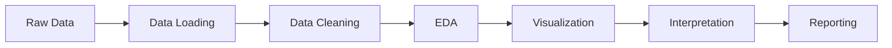

## Project Overview

This capstone project was completed as part of a university R programming and data science course. The project demonstrates proficiency in:

- Data manipulation and cleaning
- Statistical analysis
- Data visualization
- Reproducible research practices
- Technical documentation

## Methodology

### Data Science Pipeline

### Technologies Used

- **R**: Statistical computing and graphics
- **tidyverse**: Data manipulation and visualization
- **Quarto**: Reproducible reporting
- **Git**: Version control
- **Vercel**: Website deployment

## Data Source

**Tunisia Open Data Portal**  
Website: https://catalog.data.gov.tn  
Dataset: Capteur d'environnement de la station climatique

## Contact

**Student**: Your Name  
**Institution**: Your University  
**Program**: Data Science / Statistics  
**Year**: 2025-2026

## Acknowledgments

- Tunisia Open Data Initiative for providing public climate data
- Course instructors and mentors
- R and Quarto development communities

## License

This project is submitted for academic purposes. The data is publicly available under Tunisia's Open Data license.

## Repository

The complete source code, analysis scripts, and documentation are available on GitHub:

[GitHub Repository Link]

## Reproducibility Statement

This entire analysis is reproducible. All code, data processing steps, and visualizations can be regenerated by:

1. Cloning the repository
2. Installing required R packages
3. Running the analysis scripts in order
4. Rendering the Quarto website

For detailed instructions, see the README.md in the project repository.