## All Visualizations

Browse through all the visualizations created for this analysis.

### Temperature Analysis

::: {.panel-tabset}

#### Distribution
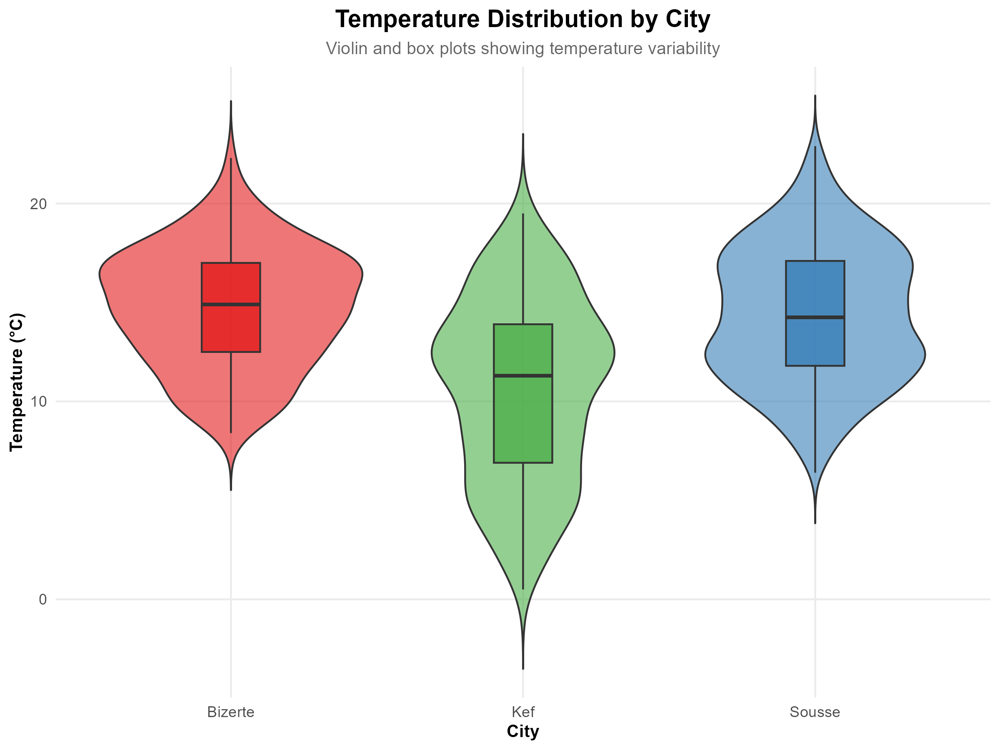

#### Trends
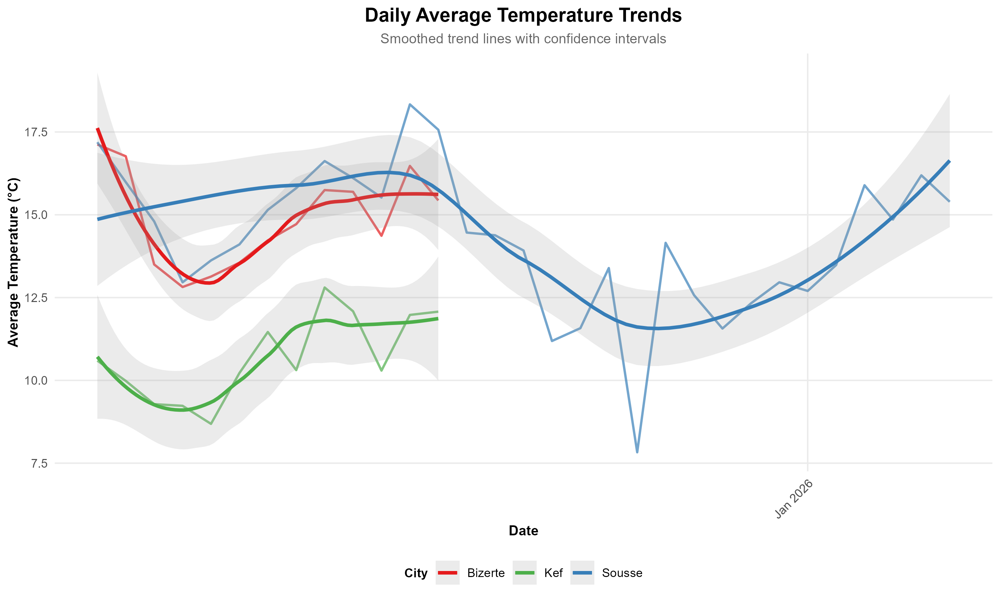

#### Seasonal
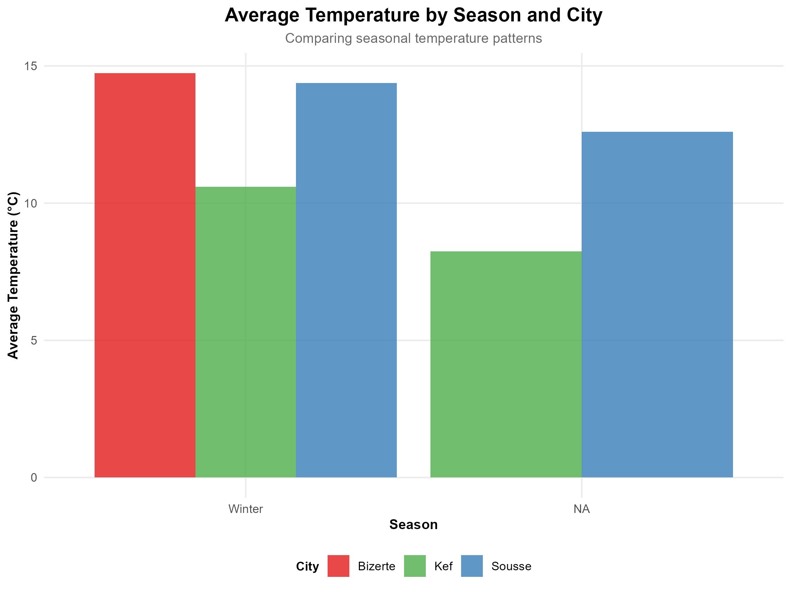

:::

### Humidity Analysis

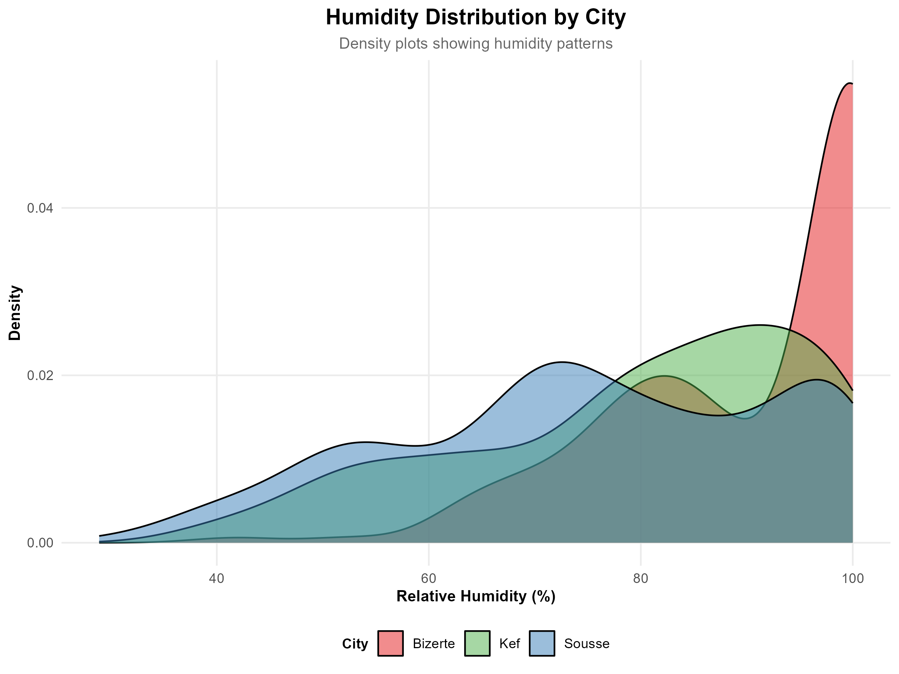

### Temporal Patterns

::: {.panel-tabset}

#### Daily Cycle
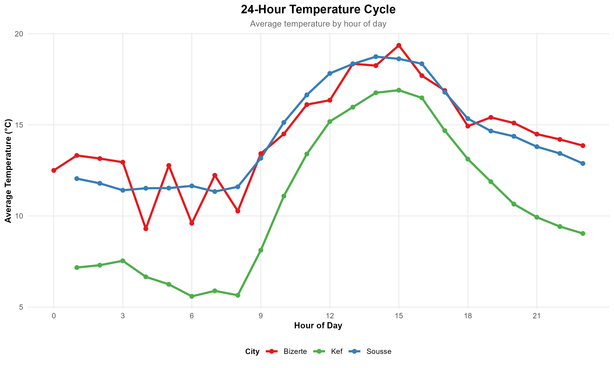

#### Monthly Heatmap
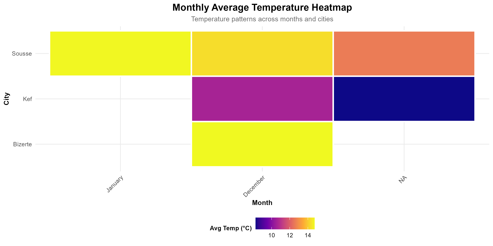

:::

### Multivariate Analysis

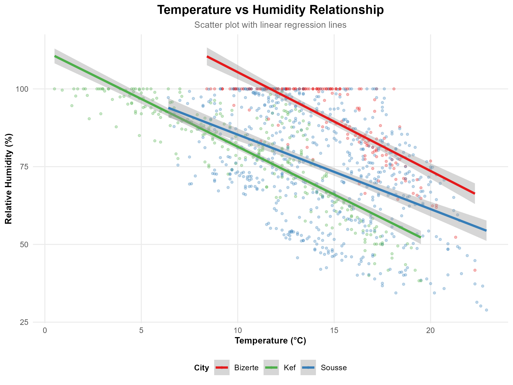

### Wind Analysis

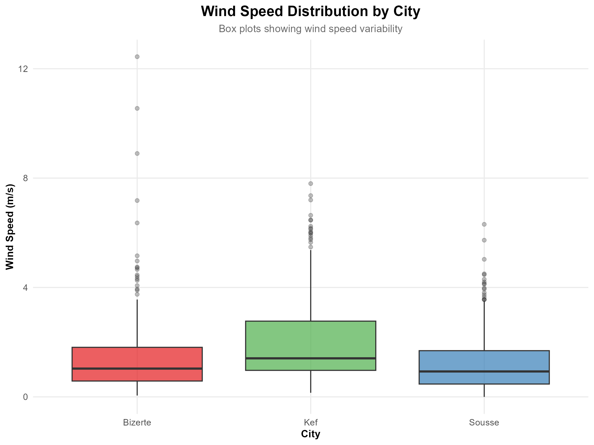

### Solar Radiation

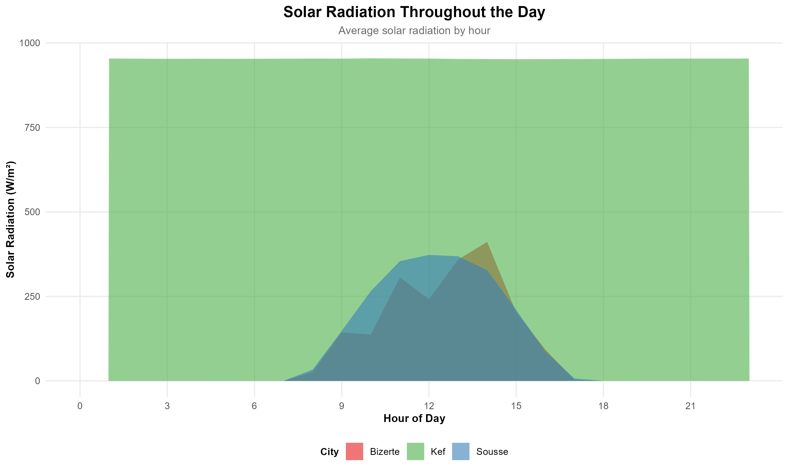

### Dashboards

::: {.panel-tabset}

#### KPI Dashboard
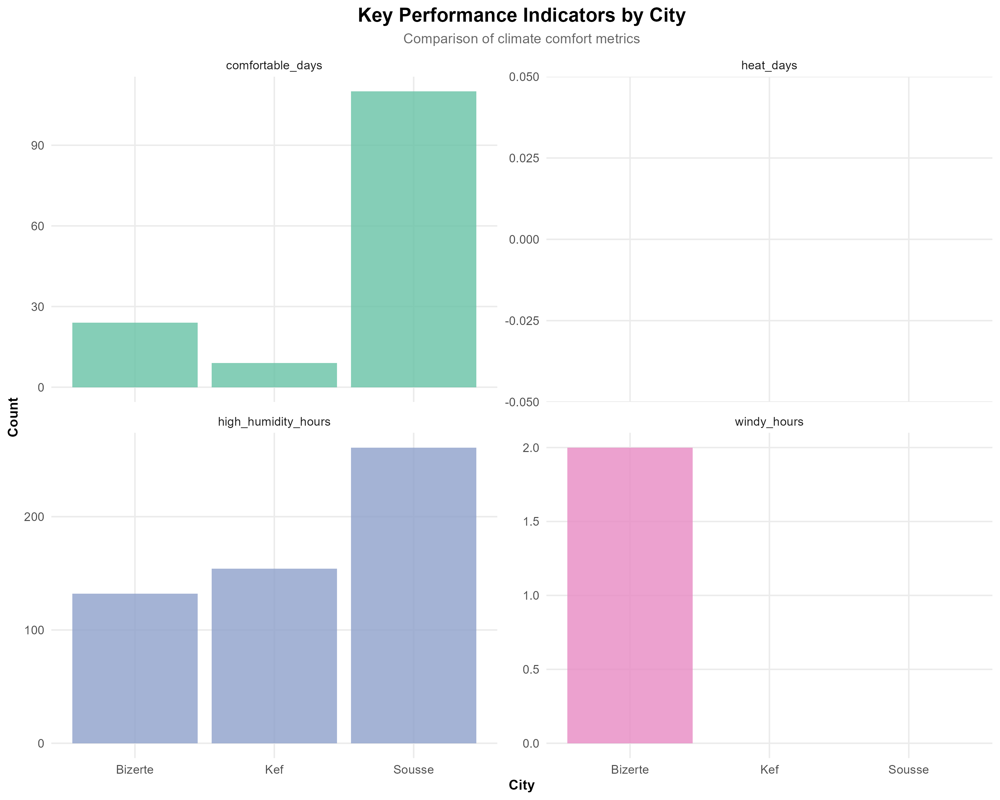

#### Comprehensive
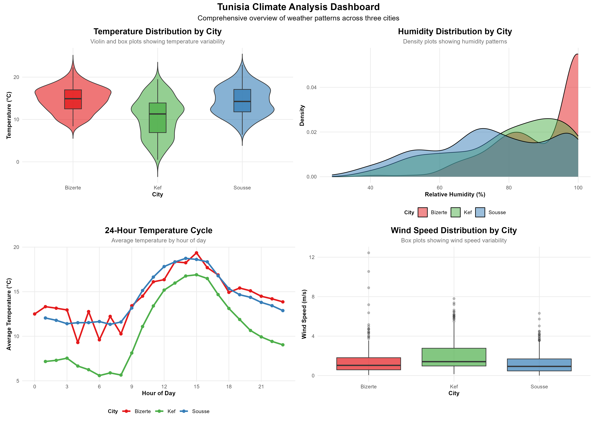

:::

## Download Figures

All figures are available in high resolution (300 DPI) in the `output/figures/` directory.